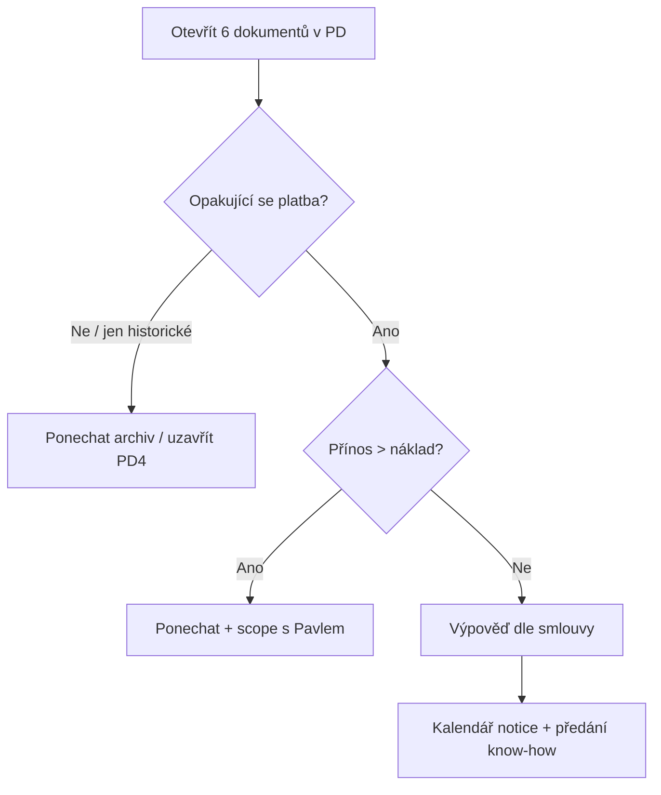

# Ninjabot — rozbor dokumentů k [[02-PROJEKTY/pipedrive-a-dalsi-nastroje#PD4 — Ninjabot: projít smlouvy / služby, rozhodnout vypověď]]

## Materiály (staženo 2026-05-20)

Všechny PDF ve složce `02-PROJEKTY/pipedrive-a-dalsi-nastroje/ninjabot/`:

| # | Soubor |
|---|--------|
| 1 | [[02-PROJEKTY/pipedrive-a-dalsi-nastroje/ninjabot/01-Objednávka Pipedrive nastavení - 1498-v2\|01 — Objednávka Pipedrive nastavení 1498]] |
| 2 | [[02-PROJEKTY/pipedrive-a-dalsi-nastroje/ninjabot/02-Ukládání dat do CRM z obchodního rejstříku - 1498-v1\|02 — Ukládání dat z rejstříku 1498]] |
| 3 | [[02-PROJEKTY/pipedrive-a-dalsi-nastroje/ninjabot/03-NB1 - Ukládání poptávek do CRM - 2298-v1\|03 — NB1 Ukládání poptávek 2298]] |
| 4 | [[02-PROJEKTY/pipedrive-a-dalsi-nastroje/ninjabot/04-Synchronizace CRM s obchodním registrem - 2298-v1\|04 — Synchronizace CRM ↔ rejstřík 2298]] |
| 5 | [[02-PROJEKTY/pipedrive-a-dalsi-nastroje/ninjabot/05-Skloňování jmen kontaktů v CRM do pátého pádu - 2298-v1\|05 — Skloňování jmen 2298]] |
| 6 | [[02-PROJEKTY/pipedrive-a-dalsi-nastroje/ninjabot/06-Přenos kontaktů z CRM do emailového nástroje - 2298-v1\|06 — Přenos kontaktů do e-mailu 2298]] |

## TL;DR

- **Kdo:** [Ninjabot](https://www.ninjabot.cz/apps/pipedrive) = oficiální **Pipedrive partner** (implementace, workshopy, automatizace CRM) — ne nutně „apka v Marketplace“.
- **Požadavek:** Pavel Kroupa (20. 5.) — ověřit **služby / smlouvy** a **případně vypovědět**.
- **6 PDF staženo** do `ninjabot/`.
- **Měsíční fakturace:** viz [[02-PROJEKTY/pipedrive-a-dalsi-nastroje/2026-05-21-analyza-ninjabot-mesicni-fakturace|2026-05-21 — rozbor měsíčních plateb]] — relevantní jen **doc 3–6** (2298); doc 1–2 jednorázové.

## Kontext

| | |
|---|---|
| **Zadavatel** | Pavel Kroupa (Slack DM → capture) |
| **Účel PD4** | Zmapovat co platíme → rozhodnout vypověď vs. ponechat |
| **Ninjabot v PD** | Dokumenty hostované na subdoméně partnera (`ninjabot.pipedrive.com`) — typicky nabídky, SOW, smlouvy nebo faktury z implementační spolupráce |

## Co je Ninjabot (veřejný kontext)

- Od **2018** Pipedrive partner; implementace **25–140 tis. Kč** (jednorázově), workshopy, automatizace, školení ([ninjabot.cz](https://www.ninjabot.cz/apps/pipedrive)).
- **Není to** samotná Pipedrive licence — ta se platí Pipedrivu zvlášť.
- Spolupráce může být: jednorázová implementace, průběžná podpora, nebo více dodatků — **bez otevření 6 PDF to neověříme**.

## Inventář dokumentů

| # | PDF (lokální) | PD odkaz | Typ | Částka / periodicita | Výpověď / platnost | Poznámka |
|---|---------------|----------|-----|----------------------|-------------------|----------|
| 1 | [[02-PROJEKTY/pipedrive-a-dalsi-nastroje/ninjabot/01-Objednávka Pipedrive nastavení - 1498-v2\|01]] | [PD](https://ninjabot.pipedrive.com/documents/p/Ni4NB1Ckm7tPK8uMiuoY9fbYYe4xKFTASg2xL7zoFji) | Objednávka implementace | **74 000 Kč** bez DPH (49k + 25k), jednorázově | Podmínky str. 10: výpověď při hrubém porušení; 100 % 1. části při podpisu | RB Associates, 2. 3. 2023, č. 1498 |
| 2 | [[02-PROJEKTY/pipedrive-a-dalsi-nastroje/ninjabot/02-Ukládání dat do CRM z obchodního rejstříku - 1498-v1\|02]] | [PD](https://ninjabot.pipedrive.com/documents/p/73dIeAdOlitoZwYBoQF7kAqbPvxVkXMb81eXIGucJSh) | Objednávka automatizace (Ares) | **15 000 Kč** jednorázově | stejné jako 1498 | Historické — bez měsíčního provozu |
| 3–6 | viz [[02-PROJEKTY/pipedrive-a-dalsi-nastroje/2026-05-21-analyza-ninjabot-mesicni-fakturace\|měsíční analýza]] | — | 4× automatizace č. 2298 | **3 650 Kč/měs** dohromady (Allfred) | VOP automatizace | Tarify: 950+1570+450+680 Kč/měs |

## Rizika (bez detailů smluv — obecně)

| Riziko | Závažnost | Co zkontrolovat v dokumentu |
|--------|-----------|----------------------------|
| Průběžný retainer / support bez jasného scope | střední | Měsíční částka, co je součástí |
| Automatické prodloužení | vysoká | Výpovědní lhůta, notice period |
| Překryv s interním RB Universe / vlastními automacemi | střední | Co dnes dělá Ninjabot vs. co už máme |
| Jednorázová vs. opakovaná platba | střední | Faktura vs. rámcovka |

## Rozhodovací flow (po vyplnění tabulky)

## Co s tím

- [x] **Stažení PDF** — `ninjabot/` (6 souborů, 2026-05-20)
- [x] **Inventář + měsíční platba** — PDF + [[02-PROJEKTY/pipedrive-a-dalsi-nastroje/2026-05-21-analyza-ninjabot-mesicni-fakturace|Allfred/RB Universe]] (2026-05-21)
- [x] **5 min s Pavlem:** které dokumenty jsou aktivní vs. historické; co chce zrušit (2026-05-21)
- [ ] **Rozhodnutí** zapsat do [[02-PROJEKTY/pipedrive-a-dalsi-nastroje#PD4 — Ninjabot: projít smlouvy / služby, rozhodnout vypověď]] (výsledek: ponechat / vypovědět / přejít)
- [ ] Pokud vypověď → termín + kdo komunikuje s Ninjabotem (Pavel vs. Lukáš)
- [ ] Ověřit, že zrušení Ninjabot **nezruší** samotnou Pipedrive licenci firmy

## Otevřené otázky

- Jsou všech 6 dokumentů **aktuální závazky**, nebo mix nabídek + starých SOW?
- Platí RB EDU **měsíční poplatek** Ninjabotu, nebo jen jednorázová implementace z minulosti?
- Kdo je **smluvní kontakt** na straně Ninjabot (Tomáš Knot / Jan Páral)?
