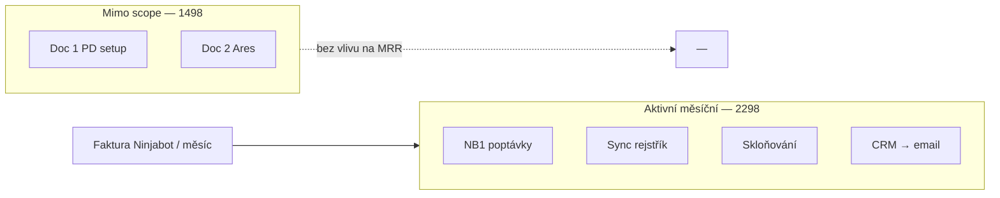
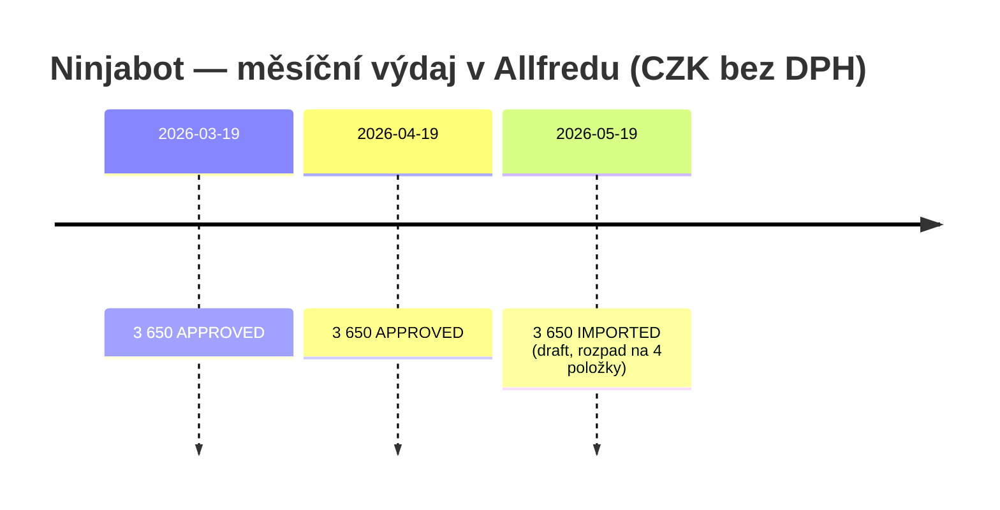

# Ninjabot — měsíční fakturace (PD4)

## TL;DR

- **Jednorázové objednávky 1498 (doc 1–2)** — implementace Pipedrive + Ares; **100 % při podpisu**, žádný měsíční provoz ve smlouvě → **mimo scope** (historické, neovlivňují dnešní měsíční platby).
- **Opakované platby** jsou jen u **4 automatizací č. 2298** (doc 3–6): model **Instalace (jednorázově) + Provoz (licence/hosting měsíčně)**.
- **Ověřeno v RB Universe (Allfred):** **3 650 Kč/měsíc bez DPH** od 3/2026 (mix tarifů: NB1 V1, Sync V2, skloňování V1, e-mail V1) — viz sekce níže.
- **Teoretický rozsah z PDF:** min. **2 830 Kč** (vše V1) → max. **13 600 Kč** (vše V3); skutečnost = **3 650 Kč**.
- **Výpověď:** veřejné VOP **neuvádí výpovědní lhůtu** u licence; jen zánik při nezaplacení. Pro vypověď → faktury + e-mail Ninjabot / právník.

## Co neřešíme (jednorázové 1498)

| Doc | Název | Jednorázově | Měsíční provoz ve smlouvě |
|-----|-------|-------------|---------------------------|
| 01 | [[02-PROJEKTY/pipedrive-a-dalsi-nastroje/ninjabot/01-Objednávka Pipedrive nastavení - 1498-v2\|Pipedrive nastavení]] | 74 000 Kč (49k + 25k) | **Ne** — jen 100 % při podpisu |
| 02 | [[02-PROJEKTY/pipedrive-a-dalsi-nastroje/ninjabot/02-Ukládání dat do CRM z obchodního rejstříku - 1498-v1\|Ares → CRM]] | 15 000 Kč | **Ne** |

Datum nabídek: březen 2023 (Tomáš Knot). Pro rozhodnutí o **aktuální měsíční faktuře** tyto dva dokumenty ignorovat.

## Opakovaná fakturace — 4× automatizace (č. 2298)

Všechny čtyři nabídky (28. 4. 2023, Jan Páral, RB Associates) mají **stejný model**:

| Položka | Kdy se fakturuje |
|---------|------------------|
| **Instalace** | 100 % při podpisu nabídky (jednorázově, už proběhlo) |
| **Provoz** | „Ve výši a frekvenci stanovené v nabídce“ — **vždy před začátkem období licence** |
| **Licence** | Součást odměny = licenční poplatek + hosting + monitoring + servis (v ceně tarifu) |

Obchodní podmínky: [ninjabot.cz/vop-automatizace](http://www.ninjabot.cz/vop-automatizace) (účinnost 17. 4. 2023).

### Ceník provozu (bez DPH, měsíčně)

Každá automatizace má **3 varianty** (limity běhů / organizací). V PDF **není zaškrtnutá** zvolená varianta — níže všechny tarify:

| # | Automatizace | PDF | V1 / měsíc | V2 / měsíc | V3 / měsíc | Instalace (jednoráz.) |
|---|--------------|-----|------------|------------|------------|------------------------|
| 3 | Ukládání poptávek do CRM (NB1) | [[03-NB1 - Ukládání poptávek do CRM - 2298-v1\|03]] | 950 Kč (30 běhů) | 1 880 Kč (65) | 4 050 Kč (150) | 6 500 Kč |
| 4 | Synchronizace CRM ↔ obch. rejstřík | [[04-Synchronizace CRM s obchodním registrem - 2298-v1\|04]] | 750 Kč (160 org.) | 1 570 Kč (330) | 3 375 Kč (750) | 5 000 Kč |
| 5 | Skloňování jmen do 5. pádu | [[05-Skloňování jmen kontaktů v CRM do pátého pádu - 2298-v1\|05]] | 450 Kč (180 běhů) | 1 300 Kč (550) | 2 800 Kč (1 250) | 2 500 Kč |
| 6 | Přenos kontaktů CRM → e-mail nástroj | [[06-Přenos kontaktů z CRM do emailového nástroje - 2298-v1\|06]] | 680 Kč (250 běhů) | 1 570 Kč (550) | 3 375 Kč (1 250) | 6 500 Kč |

**Roční platba:** sleva **20 %** na provoz (uvedeno u všech čtyř).

### Souhrn měsíční zátěže (pokud běží všechny 4)

| Scénář | Provoz/měsíc bez DPH | + 21 % DPH |
|--------|----------------------|------------|
| Všechny **Varianta 1** | **2 830 Kč** | ~3 424 Kč |
| Všechny **Varianta 2** | **6 320 Kč** | ~7 647 Kč |
| Všechny **Varianta 3** | **13 600 Kč** | ~16 456 Kč |
| Ročně (V1, −20 %) | ~27 168 Kč/rok bez DPH | ~32 873 Kč |

## Co je v provozu zahrnuto (všechny 4)

- Hosting automatizace na infrastruktuře Ninjabot
- 24/7 monitoring běhů
- Servisní podpora (hlášení poruch)
- Osobní automatizační specialista (u NB1 explicitně; u ostatních „ZDARMA součást“)
- Drobné úpravy dle záruky spokojenosti (omezeně)

**Navíc mimo měsíční tarif:** vícepráce dle hodinového ceníku (VOP: splatné 14. dne následujícího měsíce).

## Rizika pro rozhodnutí o vypovědi

| Riziko | Závažnost | Poznámka |
|--------|-----------|----------|
| Mix tarifů (ne vše V1) | **střední** | Allfred květen: 950+1570+450+680; Sync na V2 |
| 4 separátní licence = 4× provoz | **vysoká** | Vypověď může být po automatizacích, ne jedna částka |
| VOP bez výpovědní lhůty | **střední** | Veřejné VOP: zánik při neplacení; výpověď klienta **nejasná** |
| Překryv s RB Universe / vlastními skripty | **střední** | Zejména sync rejstřík (4) vs. starý Ares (2) a PD3 |
| Roční platba se slevou 20 % | **nízká** | U vypovědi může být závazek do konce předplaceného období |
| Třetí strany (Make, apod.) | **střední** | Klient platí nástroje třetích stran zvlášť (VOP + nabídky) |

## Termíny a výpověď (z dokumentů + VOP)

- **Fakturace provozu:** před začátkem období licence (typicky měsíc dopředu).
- **VOP § užívání:** nezaplacení licence → smlouva zaniká **od počátku** (tvrdé).
- **Výpověď / notice period:** v stažených PDF ani veřejných VOP **není** — ověřit u Ninjabot nebo v konkrétní podepsané verzi nabídky v PD.
- **Doc 1 (1498):** výpověď jen při hrubém porušení — u jednorázové implementace **irelevantní** pro měsíční MRR.

## Co s tím

- [x] **Ověřit skutečnou měsíční částku** — Allfred 3× doklad, 3 650 Kč/měs (2026-05-21)
- [ ] **Pavel / finance:** které automatizace ještě **běží** a které jsou mrtvé, ale fakturované
- [ ] **Mapa překryvu:** co dnes dělá RB Universe vs. Ninjabot (4, 5, 6) — kandidáti na vypověď
- [ ] **Dotaz Ninjabot:** výpovědní lhůta u licence provozu + předání / vypnutí automatizací
- [ ] Rozhodnutí PD4 zapsat do hubu: ponechat / částečně vypovědět / všechny 4

## Ověření v RB Universe (Allfred expense sync, 2026-05-21)

V produkční DB (`allfred_sync` → `expenses`) jsou **jen 3 doklady** od **Ninjabot s.r.o.** (IČ 06069185, contractor id `784`). Fakturoid sync **0** faktur na Ninjabot.

| Allfred id | DUZP | Stav | Částka bez DPH | Poznámka |
|------------|------|------|----------------|----------|
| [416](https://redbuttonedu.allfred.io/expenses/edit/?id=416) | 2026-03-19 | APPROVED | **3 650 Kč** | 1 řádek (souhrn) |
| [372](https://redbuttonedu.allfred.io/expenses/edit/?id=372) | 2026-04-19 | APPROVED | **3 650 Kč** | 1 řádek (souhrn) |
| [640](https://redbuttonedu.allfred.io/expenses/edit/?id=640) | 2026-05-19 | IMPORTED / draft | **3 650 Kč** | **4 řádky** (viz níže) |

- **Perioda:** vždy kolem **19.** v měsíci (březen–květen 2026) → **pravidelná měsíční platba 3 650 Kč bez DPH** (~**4 417 Kč s 21 % DPH**).
- **Projekt (březen–duben):** `110` = **Sales - H1/FY2026** (`2000-REZ-006`); účet SW `03`.
- **Květen (rozpad):** 950 + 1 570 + 450 + 680 Kč — odpovídá **4 automatizacím 2298** (NB1 V1, Sync **V2**, Skloňování V1, E-mail V1); ne nejnižší tarif všude (součet V1 by byl 2 830 Kč).

## Otevřené otázky

- Platíme **měsíčně nebo ročně** (−20 %)? V Allfredu zatím **měsíční** doklady; roční sleva v PDF není vidět.
- Jsou v **Allfredu** starší Ninjabot doklady před 3/2026 (jiný systém / RB Associates)?
- **Výpověď** u licence — stále chybí ve VOP; ověřit u Ninjabot před ukončením 3 650/měs.
- Existuje **novější dodatek** mimo těchto 6 PDF?
