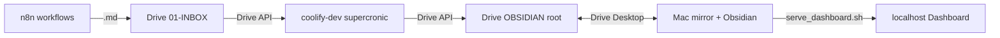

# second-brain-hub (MrLUC triage cron)

**Coolify = stateless cron** (triage, dashboard JSON do vaultu přes Drive API, edu news). **Dashboard UI = lokálně na Macu** (Obsidian / `http.server`).

Detailní architektura: [`docs/sync-architecture.md`](docs/sync-architecture.md) · implementační plán: [`docs/sync-implementation-plan.md`](docs/sync-implementation-plan.md).

## Architektura



| Kde | Co běží |
|-----|---------|
| **Google Drive** | Vault root `1YTTsTWFzrH6cNcZfvO_R-rhmSyFvlfz-` (`SECOND_BRAIN/OBSIDIAN/`) — SSOT pro vault |
| **coolify-dev** | Docker (stateless): `triage_run.py`, `build_dashboard.py`, `edu_news_refresh.py` — veškerý I/O přes Drive API |
| **Mac** | Obsidian + lokální dashboard (`scripts/serve_dashboard.sh` → `http://127.0.0.1:8765/Dashboard.html`) |

INBOX = `OBSIDIAN/01-INBOX/{slack,sembly,email,email/sent,daily}/` — relativní cesty od vault root ID výše.

## Git → Coolify Auto Deploy

| Položka | Hodnota |
|---------|---------|
| Repozitář | `https://github.com/LC-RBEDU/second-brain` |
| Větev | **`main`** |
| Base directory | `vps/second-brain-hub` |
| Host | **coolify-dev** |
| Veřejná doména | **žádná** (cron-only) |

```bash
git add vps/second-brain-hub/
git commit -m "second-brain: …"
git push origin main
```

## Coolify (dev)

| | |
|--|--|
| **Projekt** | Second Brain |
| **Aplikace** | `second-brain-hub` |
| **HTTP** | Nevystaveno (bez FQDN / Traefik) |
| **Volume** | host `/data/mrluc-second-brain` → `/data/mrluc` *(legacy safety net — odebrat v Phase 5)* |

Kontejner je **stateless**: cron nečte `/data/mrluc`, jen `/var/log/second-brain/`. Volume zůstává do stabilního týdne po cutoveru.

### Env (runtime)

V Coolify UI u každé proměnné **Available at Runtime** (v DB `is_buildtime=false`). Build-time env se do cron kontejneru **nepropisují**.

| Proměnná | Význam |
|----------|--------|
| `VAULT_DRIVE_ID` | `1YTTsTWFzrH6cNcZfvO_R-rhmSyFvlfz-` — OBSIDIAN root na Drive |
| `GOOGLE_DRIVE_OAUTH_JSON` | Single-line JSON (`client_id`, `client_secret`, `refresh_token`, …) — viz `scripts/oauth_setup.py` |
| `GOOGLE_DRIVE_SA_JSON` | volitelný fallback (Service Account); produkce používá OAuth |
| `TZ` | `Europe/Prague` |
| `CALENDAR_USER_EMAIL` | `lukas@redbuttonedu.cz` (domain-wide delegation pro kalendář) |
| `CALENDAR_DAYS_AHEAD` | `2` (dnes + zítra; max 14) |
| `GOOGLE_SERVICE_ACCOUNT_JSON` | alternativní název pro calendar SA |
| `ANTHROPIC_API_KEY` | volitelné — LLM pro EDU news rerank a extrakci e-mailových závazků |
| `ANTHROPIC_MODEL` | volitelné, default `claude-3-5-haiku-20241022` |

**Smazané (legacy):** `VAULT_PATH`, `DASHBOARD_JSON`, `LEGACY_TASKS`.

Kalendář: `cron/fetch_calendar.py` → `00-System/calendar-events.json`; `build_dashboard.py` to načte při buildu.

## Cron (Europe/Prague)

| Job | Po–Pá | So–Ne |
|-----|-------|-------|
| `triage_run.py` | 7:00, 14:00, 20:00 | 7:00 |
| `build_dashboard.py` | +5 min po triage | 7:05 |
| `build_dashboard.py` (hourly) | **8–21, :35** | **8–21, :35** |
| `edu_news_refresh.py` | 7:10 | 7:10 |
| `weekly_summary_draft.py` | — | **Ne 20:00** |
| `retro_draft.py` | — | **Ne 20:10** |
| `build_dashboard.py` (po weekly) | — | **Ne 20:15** |

Hourly rebuild drží inbox badge a pending aktuální mezi triage sloty (n8n capture).

Nedělní večer: drafty v `00-System/weekly/YYYY-Www-draft.md` a `00-System/Memory/retro-YYYY-Www-draft.md` → schválení skills `agenda-weekly-review`, `agenda-retro`. Revize priorit: ad-hoc `agenda-priority-review`.

`edu_news_refresh.py` (OPS2): z `02-PROJEKTY/*.md` (HOTOVO za posledních N dní + rozpracované úkoly s vysokým ICE) vybere max 5 témat pro EDU news → `00-System/edu-news-topics.json`, `dashboard-tasks-source.json` (`eduNews`), checklist v `operations.md`, pak `build_dashboard.py`. Po `--clear` (natočení videa) nastaví `cycleStartedAt` + `progressBaseline` — staré HOTOVO a beze změny rozpracované úkoly se znovu nenabídnou.

```bash
# po natočení videa v Cursoru (lokálně s OAuth env)
GOOGLE_DRIVE_OAUTH_JSON="$(cat ~/.config/mrluc/oauth_creds.json)" \
VAULT_DRIVE_ID=1YTTsTWFzrH6cNcZfvO_R-rhmSyFvlfz- \
python3 cron/edu_news_refresh.py --clear
```

Volitelně `ANTHROPIC_API_KEY` pro LLM přeřazení kandidátů EDU news a pro extrakci e-mailových závazků (bez klíče běží heuristika).

`triage_run.py` skenuje `01-INBOX/{slack,sembly,email,daily}/` (včetně `email/sent/`). U odeslaných e-mailů volá `triage_commitments.py` — závazky (`kind: commitment`) nebo fallback: `archive_only` / business-action úkol (např. ukončení smlouvy). Batch JSON má `proposalType`: `add_task` | `update_task` | `archive_only`. Souhrn: `*-summary.md` v češtině.

Logy: `docker logs <container>` nebo `docker exec … tail /var/log/second-brain/*.log`

Schválení triáže: v Cursoru `schval pending triáž` / `apply batch`.

## Waiting (čekání)

V `02-PROJEKTY/<téma>.md` u úkolu (`### F13 — …`):

```markdown
### F13 — Čekám na podpis
**Waiting | Čekat do: 2026-05-23**
```

- Při přesunu do Waiting se v JSON mění jen `p` → `Waiting` a `waitUntil`; **ICE a `dl` zůstávají**.
- Chybí-li datum → default **dnes + 3 dny** (Europe/Prague).
- Po vypršení `waitUntil` (den ≤ dnes, Europe/Prague) `build_dashboard.py` **automaticky** přepíše v hubu `**Waiting | Čekat do: …**` → `**ASAP | ICE …**` (ICE a deadline zůstanou), znovu syncne JSON a úkol jde do **top priority** scoringu.
- Ve sloupci Waiting zůstávají jen úkoly s `waitUntil` **po dnešku**.
- TOP priority (max 3) **neobsahuje** aktivní Waiting; po reaktivaci ano (ASAP + ICE).

## Dashboard lokálně (Mac)

Cron zapisuje do Drive: `00-System/dashboard-data.json`, `dashboard-build-stamp.json`, `Dashboard.html`. Mac je vidí přes Drive Desktop mirror.

### Auto-refresh (doporučeno)

1. **Watch** (rebuild při změně vaultu): `scripts/watch_dashboard.py` nebo `scripts/install-dashboard-watch.sh` (launchd).
2. **Serve** (polling v prohlížeči): z kořene repa `scripts/serve_dashboard.sh` → [http://127.0.0.1:8765/Dashboard.html](http://127.0.0.1:8765/Dashboard.html)

`build_dashboard.py` při každém buildu zapíše stamp; UI každých ~10 s zkontroluje a překreslí panely.

| Režim | Chování |
|-------|---------|
| **http://127.0.0.1:8765/Dashboard.html** | Live poll stamp + data (Cache-Control: no-cache) |
| **file://** (dvojklik na `Dashboard.html`) | Poll každých 60 s — hint na `serve_dashboard.sh` pokud fetch selže |

```bash
# terminál 1 — rebuild při editaci vaultu (Drive mirror path)
export VAULT_PATH="/Users/lukascypra/My Drive (lukas@redbuttonedu.cz)/SECOND_BRAIN/OBSIDIAN"
python3 scripts/watch_dashboard.py

# terminál 2 — server pro live UI
./scripts/serve_dashboard.sh
```

### Build jednorázově (proti Drive API)

```bash
cd vps/second-brain-hub
GOOGLE_DRIVE_OAUTH_JSON="$(cat ~/.config/mrluc/oauth_creds.json)" \
VAULT_DRIVE_ID=1YTTsTWFzrH6cNcZfvO_R-rhmSyFvlfz- \
python3 cron/build_dashboard.py
```

Nebo lokálně přes mirror path (legacy dev):

```bash
export VAULT_PATH="/Users/lukascypra/My Drive (lukas@redbuttonedu.cz)/SECOND_BRAIN/OBSIDIAN"
python3 cron/build_dashboard.py
```

## Lokální Docker test (cron)

```bash
docker build -t second-brain-hub:test .
docker run --rm \
  -e VAULT_DRIVE_ID=1YTTsTWFzrH6cNcZfvO_R-rhmSyFvlfz- \
  -e GOOGLE_DRIVE_OAUTH_JSON="$(cat ~/.config/mrluc/oauth_creds.json)" \
  second-brain-hub:test
```

## Coolify bootstrap

`deploy/setup-coolify.sh` — vytvoří aplikaci **bez** veřejného FQDN. Po změně domény v minulosti:

```bash
ssh coolify-dev 'bash -s' < deploy/setup-coolify.sh   # idempotentní
# nebo ručně v DB: fqdn NULL, health_check_enabled false
```

## Legacy sync (Phase 5)

`scripts/sync_vault_to_vps.sh` a volume `/data/mrluc-second-brain` jsou **deprecated** — cron už nečte lokální mirror. Smazat po >1 týdnu stabilního běhu (viz implementační plán Phase 5).
