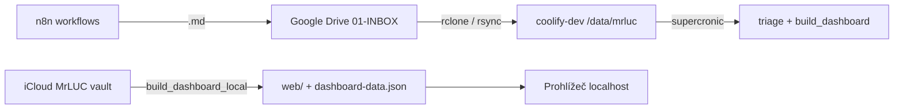

# second-brain-hub (MrLUC triage cron)

**Coolify = pouze cron** (triage, dashboard JSON do vaultu, edu news). **Dashboard UI = lokálně na Macu** (Obsidian / `http.server`).

## Architektura



| Kde | Co běží |
|-----|---------|
| **Google Drive** | `01-INBOX/{slack,sembly,email,uploads,manual}/` — SSOT pro n8n capture |
| **coolify-dev** | Docker: `triage_run.py`, `build_dashboard.py`, `edu_news_refresh.py` |
| **Mac** | Dashboard HTML + `dashboard-data.json` (žádná veřejná URL) |

INBOX root na Drive: [folder](https://drive.google.com/drive/u/0/folders/1ZaWrGl9DktNsu4K8KQZzqo2JWPtb7-ur) — ID `1ZaWrGl9DktNsu4K8KQZzqo2JWPtb7-ur`.

## Git → Coolify Auto Deploy

| Položka | Hodnota |
|---------|---------|
| Repozitář | `https://github.com/LC-RBEDU/claude-cowork` |
| Větev | **`main`** |
| Base directory | `vps/second-brain-hub` |
| Host | **coolify-dev** |
| Veřejná doména | **žádná** (cron-only) |

```bash
git add vps/second-brain-hub/
git commit -m "second-brain: …"
git push origin main
```

## Coolify (dev)

| | |
|--|--|
| **Projekt** | Second Brain |
| **Aplikace** | `second-brain-hub` |
| **HTTP** | Nevystaveno (bez FQDN / Traefik) |
| **Volume** | host `/data/mrluc-second-brain` → `/data/mrluc` |

### Env (runtime)

| Proměnná | Význam |
|----------|--------|
| `VAULT_PATH` | `/data/mrluc` |
| `TZ` | `Europe/Prague` |
| `DASHBOARD_JSON` | `/data/mrluc/00-System/dashboard-data.json` (na VPS, ne web) |
| `LEGACY_TASKS` | `/data/mrluc/00-System/dashboard-tasks-source.json` |

## Vault na VPS (sync z Macu / Drive)

MrLUC **není** v gitu. Layout na hostu = stejný jako Obsidian vault:

```
/data/mrluc/
├── 01-INBOX/slack|sembly|email|uploads|manual/
├── 02-Projekty/
├── 00-System/Triage-Pending/
└── …
```

### Jednorázově na coolify-dev

```bash
sudo mkdir -p /data/mrluc-second-brain
sudo chown 1000:1000 /data/mrluc-second-brain   # UID kontejneru
```

### Sync celého vaultu (Mac iCloud → VPS)

```bash
# z repa
VPS_HOST=coolify-dev ./scripts/sync_vault_to_vps.sh
```

### Sync jen INBOX z Google Drive mirroru (Mac)

Pokud máš na Macu zrcadlo Drive (např. `~/Library/CloudStorage/GoogleDrive-…/MrLUC/`):

```bash
rsync -avz --delete \
  "$GDRIVE_MIRROR/MrLUC/01-INBOX/" \
  coolify-dev:/data/mrluc-second-brain/01-INBOX/
```

Alternativa na serveru: **rclone** `drive:MrLUC/01-INBOX` → `/data/mrluc-second-brain/01-INBOX/` (cron na hostu, mimo tento image).

## Cron (Europe/Prague)

| Job | Po–Pá | So–Ne |
|-----|-------|-------|
| `triage_run.py` | 7:00, 14:00, 20:00 | 7:00 |
| `build_dashboard.py` | +5 min | 7:05 |
| `edu_news_refresh.py` | 7:10 | 7:10 |

`triage_run.py` skenuje pouze `01-INBOX/{slack,sembly,email,uploads,manual}/`.

Logy: `docker logs <container>` nebo `docker exec … tail /var/log/second-brain/*.log`

Schválení triáže: v Cursoru `schval pending triáž`.

## Dashboard lokálně (Mac)

```bash
cd vps/second-brain-hub
./scripts/build_dashboard_local.sh
# → otevře http://127.0.0.1:8765 (python -m http.server v web/)
```

Ručně:

```bash
export VAULT_PATH="$HOME/Library/Mobile Documents/iCloud~md~obsidian/Documents/MrLUC"
export DASHBOARD_JSON="$(pwd)/web/dashboard-data.json"
python3 cron/build_dashboard.py
cd web && python3 -m http.server 8765
```

`file://` na `index.html` často nenačte `dashboard-data.json` (CORS) — použij `http.server`.

Volitelně: data v `00-System/dashboard-data.json` v Obsidianu; UI jen pro přehled.

## Lokální Docker test (cron)

```bash
docker build -t second-brain-hub:test .
docker run --rm -v "$HOME/Library/Mobile Documents/iCloud~md~obsidian/Documents/MrLUC:/data/mrluc" second-brain-hub:test
```

## Coolify bootstrap

`deploy/setup-coolify.sh` — vytvoří aplikaci **bez** veřejného FQDN. Po změně domény v minulosti:

```bash
ssh coolify-dev 'bash -s' < deploy/setup-coolify.sh   # idempotentní
# nebo ručně v DB: fqdn NULL, health_check_enabled false
```
